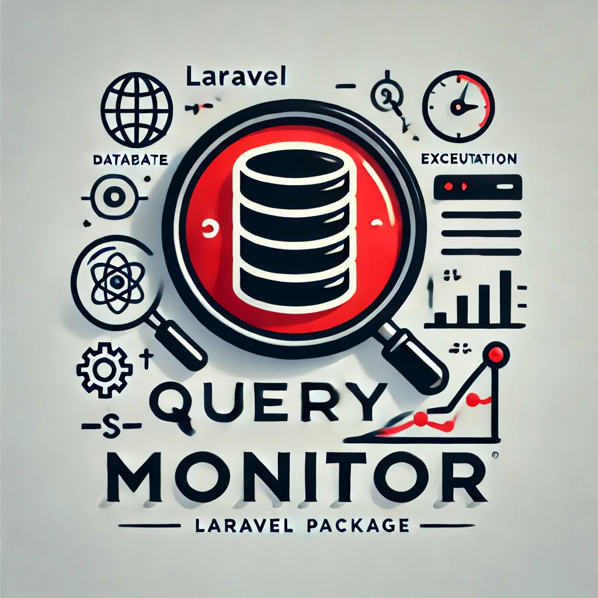

# Laravel QueryMonitor



[](https://packagist.org/packages/padosoft/laravel-querymonitor)
[](LICENSE.md)
[](https://circleci.com/gh/padosoft/laravel-querymonitor)
[](https://scrutinizer-ci.com/g/padosoft/laravel-querymonitor)
[](https://packagist.org/packages/padosoft/laravel-querymonitor)

Laravel QueryMonitor is a package for Laravel that allows you to monitor and log:
- 
- **Slow SQL Queries**: Monitors the actual execution time of SQL queries on the database.
- **Slow Eloquent Methods**: Monitors the total time taken by Eloquent methods, including PHP processing.
- **Total Number of Queries**: track the total number of SQL queries executed during a single HTTP request, Artisan command, or CLI execution.

## Requirements
- "php": ">=8.1",
- "illuminate/support": "^10.0|^11.0",
- "illuminate/database": "^10.0|^11.0",
- "illuminate/log": "^10.0|^11.0",
- "illuminate/config": "^10.0|^11.0"

## Installation
You can install the package via Composer:

```bash
composer require padosoft/laravel-querymonitor
```
Publish the configuration and migrations:

```bash
php artisan vendor:publish --provider="Padosoft\QueryMonitor\QueryMonitorServiceProvider" --tag="config"
```

## Configuration
The package configuration file is located at config/querymonitor.php. 
You can adjust the settings to suit your application's needs:
```php
return [

    'query' => [
        'attiva' => env('QUERYMONITOR_QUERY_ATTIVA', true),
        'maxExecutionTime' => env('QUERYMONITOR_QUERY_MAX_EXECUTION_TIME', 100), // in milliseconds
        'sqlRegEx' => env('QUERYMONITOR_QUERY_SQL_REGEX', '^SELECT.*$'),
    ],

    'query_builder' => [
        'attiva' => env('QUERYMONITOR_BUILDER_ATTIVA', true),
        'maxExecutionTime' => env('QUERYMONITOR_BUILDER_MAX_EXECUTION_TIME', 200), // in milliseconds
        'methodRegEx' => env('QUERYMONITOR_BUILDER_METHOD_REGEX', '^(get|first)$'),
    ],

    'total_queries' => [
    
        /*
         * Whether to enable total query monitoring.
         */
        'attiva' => env('QUERYMONITOR_TOTAL_QUERIES_ATTIVA', true),
    
        /*
         * Maximum allowed total queries per request/command.
         * If this threshold is exceeded, a warning is logged.
         */
        'maxTotalQueries' => env('QUERYMONITOR_MAX_TOTAL_QUERIES', 500),
    
        /*
         * A regex to filter which contexts to monitor.
         * - For HTTP requests, this regex will be matched against the full URL (including query string).
         * - For Artisan commands, it will be matched against the command name.
         * - For CLI contexts, it can be matched against the script name.
         * If unset or empty, all contexts are monitored.
         * Example: '^/api/.*$' to monitor only requests under /api/
         */
        'traceRegEx' => env('QUERYMONITOR_TOTAL_QUERIES_REGEX', null),
    ],
];
```


## Usage

Once installed and configured, the package will automatically monitor and log SQL queries and Eloquent methods based on the provided settings.
If you setting query total count to true, the package will automatically monitor and log total queries count.

### Monitoring SQL Queries
- **What it monitors**: The execution time of SQL queries on the database.
- **How it works**: Uses DB::listen() to listen to all executed queries.
- **When it logs**: If the execution time exceeds maxExecutionTime and the query matches sqlRegEx.

**Example Log Entry:**

```bash
[2024-11-28 12:34:56] local.INFO: QueryMonitor Slow SQL query detected {"query":"SELECT * FROM `users` WHERE `id` = '1'","execution_time":"150 ms"}
```

### Monitoring Eloquent Methods
- **What it monitors**: The total execution time of Eloquent methods, including PHP processing.
- **How it works**: Extends Eloquent's Builder and overrides key methods.
- **When it logs**: If the execution time exceeds maxExecutionTime and the method name matches methodRegEx.

**Example Log Entry:**

```json
{
    "method": "get",
    "execution_time": "250 ms",
    "query": "SELECT * FROM `articles` WHERE `status` = 'published'",
    "arguments": [
        ["*"]
    ],
    "stack_trace": [
        {
            "file": "/path/to/your/project/app/Models/QueryBase.php",
            "line": 123,
            "class": "App\\Models\\QueryBase",
            "function": "getPublishedArticles"
        },
        {
            "file": "/path/to/your/project/app/Http/Controllers/ArticleController.php",
            "line": 45,
            "class": "App\\Http\\Controllers\\ArticleController",
            "function": "index"
        },
        // ... additional frames up to the maximum stack depth
    ]
}
```

## Difference Between Monitoring SQL Queries and Eloquent Methods
**SQL Queries**
- **Database-Focused**: Measures the time taken by the database to execute a query.
- **Usefulness**: Identifies unoptimized queries or database-level issues.
- **Example**: A query that takes 500 ms to execute on the database will be logged if it exceeds the threshold.

**Eloquent Methods**
- **Application-Focused**: Measures the total time taken by an Eloquent method, including PHP processing.
- **Usefulness**: Identifies bottlenecks in the application due to heavy PHP processing.
- **Example**: A get() method that retrieves many records and takes 800 ms to complete will be logged if it exceeds the threshold, even if the underlying SQL query is fast.

**Why Both?**
- **Complete Visibility**: By monitoring both SQL queries and Eloquent methods, you get a full view of performance, from the database to the application.
- **Effective Optimization**: You can identify if performance issues are due to the database or PHP code.

## Practical Example
Suppose we have the following code:

```php
$users = User::all();
```

- **SQL Query Execution Time**: 50 ms.
- **Total Eloquent Method Time**: 600 ms.

**Analysis:**

- **Fast SQL Query**: The database returns the data quickly.
- **Slow PHP Processing**: Creating User objects for many records takes time.
- **Action**: Consider using pagination or limiting the selected fields.


## Monitoring the Total Number of Queries
In addition to monitoring slow queries and slow Eloquent methods, laravel-querymonitor allows you to track the total number of SQL queries executed during a single HTTP request, Artisan command, or CLI execution. 
This helps you identify cases where, although each individual query may be performant, the total number of queries is excessively high, potentially causing performance bottlenecks.

**Why Monitor Total Queries?**
Even if every single query is fast, executing too many queries per request or command can cause unnecessary overhead. 
By monitoring the total query count, you can quickly identify scenarios where your application issues an excessive number of queries (for example, 2,000 queries in a single request), 
pinpointing areas that need optimization (e.g., using eager loading, caching, or refining data retrieval logic).

**How It Works**
- For HTTP requests, a middleware hooks into the Laravel request lifecycle. It resets a query counter at the start of the request and increments it every time a query is executed. 
At the end of the request, if the total number of queries exceeds the configured threshold, a warning is logged.
- For Artisan commands, the package listens to the CommandStarting and CommandFinished events. 
It resets the counter before the command runs and checks the final count after the command completes.
- For CLI contexts (other non-command CLI scripts), you can manually integrate by resetting and checking counts in your own script logic.

### Configuration
All configuration options are defined in the querymonitor.php config file under the total_queries key:
```php
'total_queries' => [

    /*
     * Whether to enable total query monitoring.
     */
    'attiva' => env('QUERYMONITOR_TOTAL_QUERIES_ATTIVA', true),

    /*
     * Maximum allowed total queries per request/command.
     * If this threshold is exceeded, a warning is logged.
     */
    'maxTotalQueries' => env('QUERYMONITOR_MAX_TOTAL_QUERIES', 500),

    /*
     * A regex to filter which contexts to monitor.
     * - For HTTP requests, this regex will be matched against the full URL (including query string).
     * - For Artisan commands, it will be matched against the command name.
     * - For CLI contexts, it can be matched against the script name.
     * If unset or empty, all contexts are monitored.
     * Example: '^/api/.*$' to monitor only requests under /api/
     */
    'traceRegEx' => env('QUERYMONITOR_TOTAL_QUERIES_REGEX', null),
],
```

### Enabling Total Query Monitoring for HTTP Requests
To track the total number of queries for HTTP requests, the package provides a `TrackTotalQueriesMiddleware`. 
This middleware must be added as the first middleware in the global middleware stack. 

By doing so, it can:

- **Set up tracking before any other middleware or controllers run**, ensuring that all queries executed during the request lifecycle are counted.
- **Perform a final check after the response is generated**, running last in the outbound cycle, so that it includes queries made by all subsequent middleware, controllers, and operations performed downstream.

**How to add it:**

In your `app/Http/Kernel.php`, ensure that `\Padosoft\QueryMonitor\Middleware\TrackTotalQueriesMiddleware::class` appears at the top of the `$middleware` array:

```php
protected $middleware = [
                        \Padosoft\QueryMonitor\Middleware\TrackTotalQueriesMiddleware::class,
                        // ... other global middleware ...
                        ];
```

By placing the TrackTotalQueriesMiddleware first, you guarantee comprehensive coverage of every query executed during the request lifecycle. 
Once the request is fully processed, the middleware checks the total query count and logs a warning if it exceeds the configured threshold.


### Examples of Logs
- **1. HTTP Request Exceeding the Query Limit**

If a request executes more than the allowed number of queries, a log entry is created after the response is generated:

```text
[2024-12-09 10:23:45] local.WARNING: Exceeded maximum total queries: 2020 queries (max: 500). {"context":"request","url":"https://example.com/products?category=shoes","method":"GET"}
```
- context: request
- url: The full URL of the request, including query parameters.
- method: The HTTP method (e.g., GET, POST).

- **2. Artisan Command Exceeding the Query Limit**

If an Artisan command triggers more queries than allowed, a warning is logged once the command finishes:

```text
[2024-12-09 10:25:10] local.WARNING: Exceeded maximum total queries: 1200 queries (max: 500). {"context":"command","command":"cache:clear","arguments":["artisan","cache:clear"]}
```
- context: command
- command: The Artisan command name.
- arguments: The arguments passed to the command.

- **3. CLI Context Exceeding the Query Limit**

For CLI contexts (non-Artisan commands), if you set up tracking manually and the query count is exceeded, you'll see a log like:

```text
[2024-12-09 10:26:00] local.WARNING: Exceeded maximum total queries: 3000 queries (max: 500). {"context":"cli-service","script":"myscript.php","arguments":["--option","value"]}
```
- context: cli-service
- script: The name of the CLI script being executed.
- arguments: The arguments passed to the script.

**Using the Regex Filter**
If you provide a traceRegEx:

- For HTTP requests, the package only monitors requests whose URLs match the regex.
- For Artisan commands, only the commands that match the regex pattern are monitored.
- For CLI contexts, only scripts whose name matches the regex are tracked.

For example, if you set:

```php
'traceRegEx' => '^/api/.*$',
```
only requests matching /api/... URLs are monitored.

**Summary**
By configuring and enabling total query monitoring, you gain deeper insights into your application's performance, identifying excessive query usage patterns that can be addressed to improve overall efficiency. 
This is especially useful in complex, large-scale projects where minor optimizations in query counts can lead to significant performance gains.


## Final Notes
- **Performance Optimization**: Remember that enabling monitoring can impact performance. It's advisable to use it in development environments or carefully monitor the impact in production.
- **Dynamic Configuration**: You can modify the settings in real-time using environment variables or by updating the configuration file.
- **Extensibility**: The package can be extended to include additional features or to suit specific needs.


## Testing
The package includes unit tests to ensure all components function correctly. 
Run tests using PHPUnit:

```bash
composer test
```

## Change log

Please see [CHANGELOG](CHANGELOG.md) for more information what has changed recently.

## Testing

``` bash
composer test
```

## Contributing

Please see [CONTRIBUTING](CONTRIBUTING.md) for details.

## Security

If you discover any security related issues, please email instead of using the issue tracker.

## Credits
- [Lorenzo Padovani](https://github.com/lopadova)
- [All Contributors](../../contributors)

## About Padosoft
Padosoft (https://www.padosoft.com) is a software house based in Florence, Italy. Specialized in E-commerce and web sites.

## License

The MIT License (MIT). Please see [License File](LICENSE.md) for more information.
